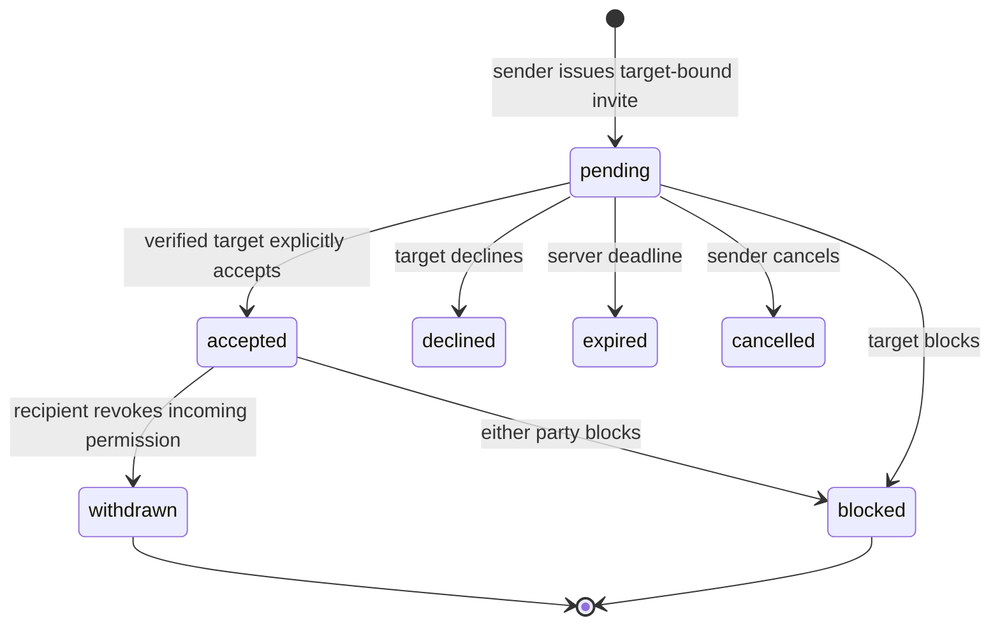
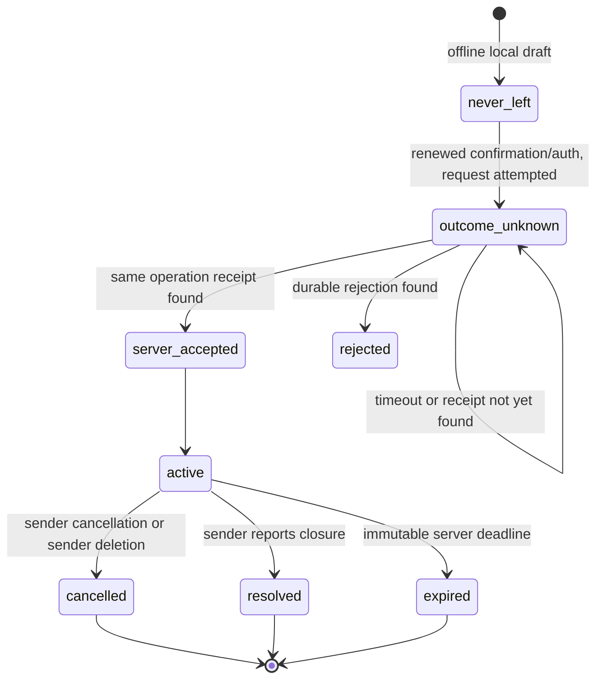
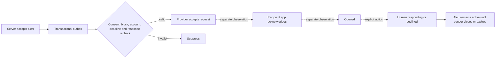

# Identity, directional consent and synchronization design

Review date: 2026-09-28. Status: proposed, revisable; isolated rule simulations only. Base inspected: main `a1ffbec01bd7cc39409bbd740639606fe2f29e39`. Existing native interfaces, tests and local persistence remain unchanged. No backend or provider account exists as a result of this stage.

## Decisions and ownership

| Decision | Proposed rule | Owner / revisit gate |
|---|---|---|
| D1 Identity | Immutable internal UUID independent of display name and provider subject. Verified email initially; no SMS. | Account service; before local trial |
| D2 Authentication | Provisionally Supabase Auth email OTP with confirmed email, pending local comparison gate. Do not implement passwords or cryptography. | Authentication adapter |
| D3 Consent | Recipient explicitly accepts sender → recipient permission. Reverse direction requires another invitation. | Transaction service |
| D4 Authority | Shared server state authoritative; native view is an account-bound replica. | Sync adapter |
| D5 Safety of claims | Provider acceptance, app acknowledgement, opening and human response are different facts. None proves sound or safety. | Product + UI |
| D6 Conflict | First committed explicit response per recipient account wins, using version comparison. No implicit last-write-wins. | Transaction service |
| D7 Expiry | Server-fixed lifetime ≤15 minutes; retries/additions never extend it. | Alert service |
| D8 Retention | Alert details 30 days after terminal closure; a provisional product choice, not a legal requirement. | Product/privacy review |
| D9 Trial limits | At most five recipients/alert, initial attempt plus one manual retry each, ≥60 seconds apart; no autonomous escalation. | Product; revisit using abuse/usability evidence |
| D10 Delivery boundary | No external deployment, signup, email, SMS or notification in this stage; PR requires review and stays unmerged. | Stage authorization |

## Identity and account lifecycle

The authentication adapter maps `(issuer, subject)` uniquely to an internal `user_id`. The provider's verified email is a contact/acceptance attribute, never a primary key or proof of a real-world person. Display names can collide and change without affecting authority. Email comparison must use the provider's canonicalization, not invented dot/plus alias rules. The fixture model lowercases `.invalid` addresses only; production canonicalization needs provider tests. The app does not receive a service-role secret.

1. Registration: obtain explicit terms/privacy consent, request an established provider's email OTP, use generic delivery messages, verify the one-time challenge, then atomically provision the subject mapping and profile. Unverified sessions cannot use shared APIs. Record policy versions/timestamps, not a blanket grant for contacts.
2. Login: provider SDK handles the email challenge and token refresh; validate issuer, audience, signature, expiration, verified email, mapped account status and active server session on every protected request. Use established SDK validation, Keychain storage and TLS. Links require an allowlisted callback; never put invitation authority in the auth callback.
3. Recovery: repeat verified email authentication; no homemade password reset. Lost mailbox means no automatic identity transfer. A future recovery policy must establish proof before relinking an account; creating a new identity does not inherit consent/history. Email changes require provider reauthentication, verification of the new address, revocation of other sessions, and invalidation of pending invitations bound to the old address. No automatic account merging.
4. Logout: revoke this server session, unregister that device binding and destroy its local cache, drafts, pending operations and tokens. An offline logout wipes locally immediately and reports server revocation pending; it cannot promise remote revocation until acknowledged. A remote revoke-all option invalidates all sessions/device bindings; old access JWTs must also be rejected by server session/account checks.
5. Account deletion: require provider reauthentication within five minutes, immediately mark the account inactive, revoke all sessions and device bindings, invalidate invitations/consent, suppress pending outbox jobs, cancel active alerts it sent, and erase profile/email. Retain only minimum pseudonymous participant/tombstone records until their explicit expiry. Delete the provider identity through a privileged asynchronous task with retries and a deletion ledger; local logout must not depend on that task succeeding. The reference simulates immediate effects, not provider cleanup.

Supabase's session record check and Firebase's revocation check matter because validating an unexpired JWT alone is not immediate revocation. [Supabase sessions](https://supabase.com/docs/guides/auth/sessions), [Firebase session management](https://firebase.google.com/docs/auth/admin/manage-sessions).

Face ID/Touch ID unlocks the local app and confirms local send/retry/add actions through the existing native gate. A body field such as `face_id_success: true` is rejected by the contract. It is **not** server-verifiable authentication. Shared alert actions require an active verified session; the current proposal does not require an email OTP on every urgent send. Consent acceptance and account deletion require a recent provider-verified authentication time (five minutes), never a client-supplied timestamp. Whether high-risk sending needs stronger server-verifiable step-up is a deferred product/security decision, not a capability claim. The wire `issued_at` only bounds stale requests; a hostile client can choose it, so it is not proof of human confirmation.

## Invitations and consent

An invitation targets one verified email without searching a public directory. No address-book upload. Generate 32 random bytes using a standard cryptographic RNG; store a digest, not the bearer value, in the invitation row. A link expires in 24 hours, is one-use and is accepted only by the authenticated account whose verified email matches. Short numeric codes are deferred because they need stronger guessing protection. The sender may copy the link using the OS share sheet in a later authorized stage; no mail is sent by this model.

The full bearer token is sensitive: return it only to its owner at issuance/idempotent issuance replay, never in telemetry or ordinary logs. Store the receipt's recoverable token encrypted with managed keys if retained for replay, erase it on expiry/cancellation/use, and thereafter return null. The in-memory model is not encrypted storage. Generic issuance responses avoid disclosing account existence; invalid token/wrong target share `not_found`. Do not log URLs or email addresses.

Provisional abuse limits: 10 invitation creations/sender/day, five acceptance attempts/account/minute; production must additionally enforce three active invitations per sender-target pair, target cooling-off, ingress/IP and installation limits, payload limits, abuse reporting and circuit breakers. Distributed/target limits are **specified, not proven** by the reference's account counters. Rate-limit before expensive token processing and avoid a bypass via new operation IDs. Multiple accounts/rotating networks remain a production abuse concern.

| State | Allowed next state / actor |
|---|---|
| pending | accepted/declined by intended verified invitee; cancelled by inviter; expired by server; blocked by invitee |
| accepted | withdrawn by recipient; blocked by either participant; invalidated on deletion |
| declined / expired / cancelled | Terminal for that invitation; a fresh invitation is necessary |
| withdrawn / blocked | No sending grant; unblocking does not restore it; fresh explicit acceptance necessary |

Blocking is unilateral and suppresses both directions; withdrawal revokes only the incoming direction. Existing active alerts remain active for other participants, but the affected recipient loses detail/response access and pending work is suppressed. Sender history shows only “permission unavailable,” not the other person's private reason. Previously recorded responses are historical facts, not a continuing permission. Reacceptance does not restore access or notifications to old alerts. Closing a screen is local UI only.

## Data model (proposed production tables)

All IDs UUIDs; timestamps server UTC; all shared mutations transactional. Provider tokens, push tokens and email are never included in public views.

| Entity / key | Minimum fields and constraints |
|---|---|
| accounts / user_id | active/deleting/deleted, display_name, created_at; immutable ID |
| identities / (issuer, subject) unique | user_id FK, provider_verified_email, verified_at; encrypted contact attribute |
| sessions / session_id | user_id, provider_session_id, device_id, auth_time, expiry, revoked_at; recheck every request |
| devices / device_id | owner_user_id, session binding, encrypted APNs token if later enabled, environment; one owner at a time |
| invitations / invitation_id | sender_id, intended_email, token_digest unique, state, expires_at, accepted_by, version |
| grants / (sender_id, recipient_id) | state, consent_version, accepted_at, withdrawn_at, invitation_id; sender != recipient |
| blocks / (blocker_id, target_id) | created_at; deny in either direction |
| alerts / alert_id | sender_id, state, version, created_at, immutable expires_at, closed_at; no location or audio |
| recipients / (alert_id, user_id) | response none/responding/declined, response_version, access_state, attempt_count; max five |
| acknowledgements / (alert_id, user_id, device_id, event_id) | kind, server_received_at; duplicates must match original event semantics |
| operations / (actor_id, operation_id) | canonical request digest, status, result resource ID, created_at; atomic with mutation |
| outbox / job_id | alert_id, recipient_id, attempt ordinal, state, deadline, provider reference; unique attempt key |
| history_hides / (user_id, alert_id) | hidden_at; cannot hide active work or erase another participant's record |
| deletion_ledger / opaque tombstone | scope, requested_at, completed_at, backup_expiry; no profile content |
| sync_feed / (user_id, sequence) | opaque resource ID, version/tombstone; authorize every fetch; no cross-user sequence contents |

The reference uses one process-wide monotonic sync sequence and full snapshots; production should allocate per-account cursors to avoid leaking unrelated activity and add pagination with stable snapshot isolation. Wire views map blocked/withdrawn/deleted access to generic “unavailable” for senders, while internal rule state keeps the distinction. No other recipients' IDs or device acknowledgements are returned to a recipient.

## Permission matrix

| Operation | Sender | Target recipient | Unrelated C | Server worker |
|---|---|---|---|---|
| Invite | Own issuance/cancel pending only | Accept/decline intended invite; recent auth | Denied | Expire |
| Grant consent | Cannot self-grant | Own incoming direction only | Denied | Validate/expire |
| Withdraw/block | Can block a known participant | Withdraw incoming or block participant | Denied | Suppress pending work |
| Create/retry/add | Own alert, current consent, version, limits, deadline | No sender authority | Denied | Recheck before handoff |
| Read details | Own retained alert | Own participating row while access remains | Generic 404 | Scoped service role only |
| Acknowledge/open | Not on behalf of recipient | Own bound device only | Denied | Record technical provider result only |
| Respond/decline | Cannot forge recipient response | Own account once, current version | Denied | Cannot invent human response |
| Cancel/resolve | Explicit action on own active alert | Cannot globally close | Denied | Expire; deletion cancellation |
| Hide history | Own terminal record only | Own terminal record only | Denied | Retention purge |
| Delete account | Own account after reauth | Own account after reauth | Denied | Revoke, purge, tombstone |

Sender “resolved” is a reported closure, never independently verified safety. All-recipient decline also does not resolve an alert. Acknowledgements are per-device, summarized per account by existence of app acknowledgement/open; do not display “all devices received.” Human response is per account, first valid commit wins. A stale or conflicting second device must fetch the winner and show it, not silently overwrite it. Changing an already committed response is deferred; user may communicate outside the app.

## State diagrams

Dotted edges are not guaranteed delivery. A recipient can explicitly respond after fetching state without a prior push acknowledgement. An app-open event does not establish attention, audibility or safety.

## Transactions, synchronization and race boundaries

For each mutation: authenticate/revocation check; find actor-scoped operation receipt; reject fingerprint mismatch; validate fresh envelope; lock account, block/grant and alert rows in stable UUID order; evaluate authoritative clock/version/permissions; atomically write state + operation receipt + sync events + outbox rows. Use a unique `(actor, operation_id)` index. Resolve concurrent insertion by returning the committed receipt. Retry serialization failures internally with the **same** operation ID, bounded, before returning a retryable transport error. Never make provider calls inside a retried transaction. [PostgreSQL isolation](https://www.postgresql.org/docs/current/transaction-iso.html).

Outbox workers claim a unique attempt, then recheck active accounts, grant version, blocks, recipient response, alert state and deadline immediately before authorizing handoff. Consent revocation and handoff authorization must serialize on the same grant/alert keys. If revocation wins, suppress. If handoff authorization wins first, a concurrent revocation cannot retract that provider request. Do not claim that a database lock makes the external network call atomic: record authorized-at/provider outcome separately, expire the APNs request at the original alert deadline and surface uncertain provider outcomes. A worker timeout after sending must not blindly submit another attempt; provider-level exactly-once is not proven. The reference models the two orderings, not this external uncertainty.

Manual retry is allowed once per unanswered active recipient after 60 seconds; pending/uncertain provider attempts are not eligible for another handoff. Adding recipients is explicit, atomic and requires new current grants; total remains five. Expiry is immutable. No automatic escalation or re-alerting people who responded/declined. Authentication + fresh local confirmation is repeated before intentional retry/addition; server still independently validates all rules.

Offline: distinguish **never left / not sent** from **attempted / outcome unknown**. Never place urgent mutation requests in a generic networking SDK's automatic offline write queue. Reconnect only fetches current state or queries the same operation ID. A 404 receipt is not proof of non-execution if a request could still be in flight: keep uncertain, query after bounded backoff, or reconcile the original immutable envelope under the same ID after explicit renewed confirmation. Do not allocate a new alert automatically. A never-left draft can be reviewed and discarded/recreated only through explicit confirmation/authentication, with a new deadline shown to the user. No retries or edits silently change an accepted alert's deadline.

A full authenticated snapshot replaces the current account's replica atomically; only a newer cursor applies. Tombstones/hides/revocations remove cached details. Older snapshots/events cannot restore terminal or revoked records. On logout/switch, cancel subscriptions, advance an account-generation marker and purge local caches/Keychain/queued operations; reject callbacks for the previous owner/generation. Offline caches are labeled stale; no response is enabled until the server confirms current validity. A generic already-delivered push can remain in Notification Center; tapping it fetches authority before revealing details or responding, showing “no longer available” if revoked/expired. Removing locally known delivered notifications is best effort, not provider recall.

## Privacy, deletion and retention

Only identity attributes, directional grants, minimal alert/response facts and necessary technical timestamps. No location, address book, audio recordings or family-member demonstration names. Fixtures use Sami, Sara, Noor and `example.invalid` emails.

The future notification payload contains an opaque alert ID and generic “Open NIDAA to check a new update,” without names, emergency details, email, response, session tokens or invitation tokens. Production push credentials stay on a server, device tokens encrypted at rest and scoped by environment/account. Logs allow only random trace/operation IDs, coarse outcome codes, duration and aggregate counters; redact headers, request bodies, links, email and APNs device tokens. Security log retention is provisionally seven days, with access controls; do not log the Python fixture/session structures.

| Action | Local effect | Server / other participants | Backups |
|---|---|---|---|
| Hide my history | Remove terminal record from my replica | Own hide marker only; others retain their allowed record | Normal expiry |
| Withdraw/block | Remove affected cached details after sync; disable action immediately locally | Revoke access, suppress pending work; minimum history facts remain for others | Deletion/revocation ledger reapplied on restore |
| Delete account | Wipe own cache, pending drafts, credentials and device binding | Immediate auth barrier; remove profile/contact data; pseudonymous counterpart history may remain until retention ends | Deletion may remain in immutable backup until configured expiry |
| Retention purge | Remove via sync or local expiry sweep even if offline | Purge alert details 30 days after closure; sweep at least daily with reads enforcing deadline | Proposed backup maximum 35 days; restore in isolation then replay deletion ledger before access |

Minimal operation-ID/fingerprint tombstones: 90 days; no invitation secret after use/expiry. The server rejects an old original envelope even after its receipt ages out. Tombstones, hide markers and deletion ledgers need their own expiry jobs; a disconnected client older than the sync horizon must receive a full reset, not incremental resurrection. Proposed technical tombstone horizon 90 days; backup deletion ledger retained at least through the last backup containing affected data plus restore verification. The reference tests alert/operation/secret purge but does not emulate immutable backups or a production deletion worker.

Shared pseudonymous IDs/response facts can remain personal data; do not market deletion as instant erasure of all copies, screenshots or other participants' memories. Jurisdiction, lawful retention, residency and backup policy remain review questions before real-user use.

## Deferred questions and evidence gates

- Confirm the mailbox recovery policy and whether mutual consent should be a separate optional second invitation (never automatic).
- Review TTL, retry/cooling-off, 30-day details, 90-day tombstone and 35-day backup assumptions for usability/privacy and cost.
- Select exact deployment jurisdiction after reviewing all services' data locations; database region alone is insufficient.
- Decide stronger server-verifiable step-up for sensitive sends without treating biometrics as a remote attestation.
- Implement and test transaction races, RLS, session revocation and deletion recovery with a real **local** provider stack before adopting a hosted service.
- Physical iPhone notification reception, APNs routing, sound, Focus, Bluetooth and Critical Alerts remain deferred because no Apple devices are available. They are not prerequisites for this specification stage.
